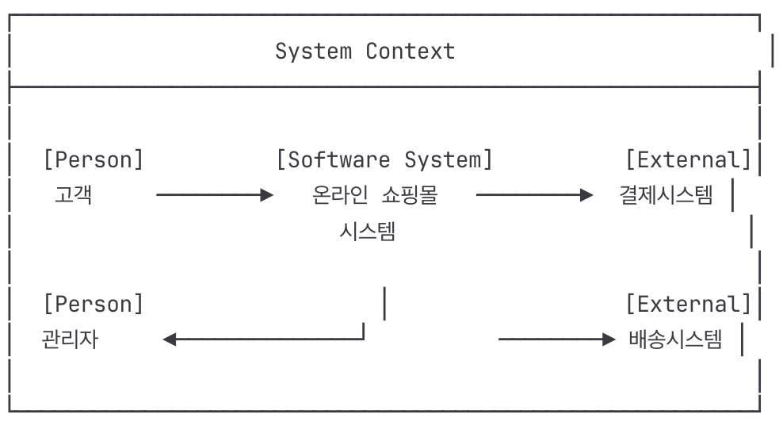
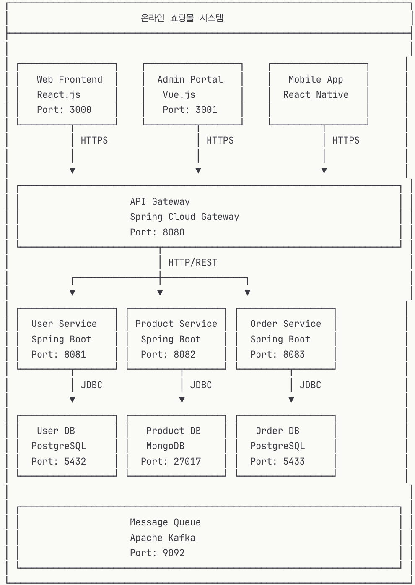
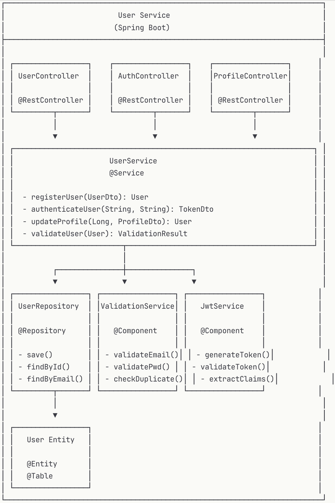
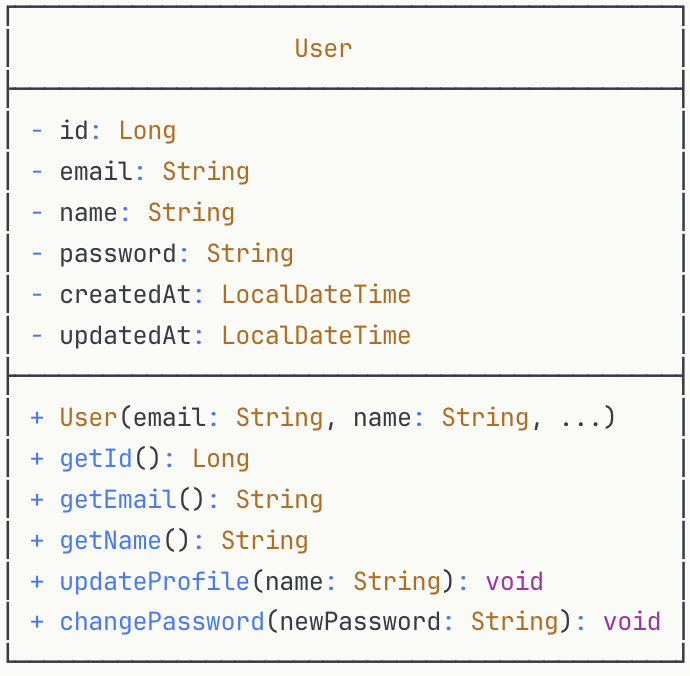
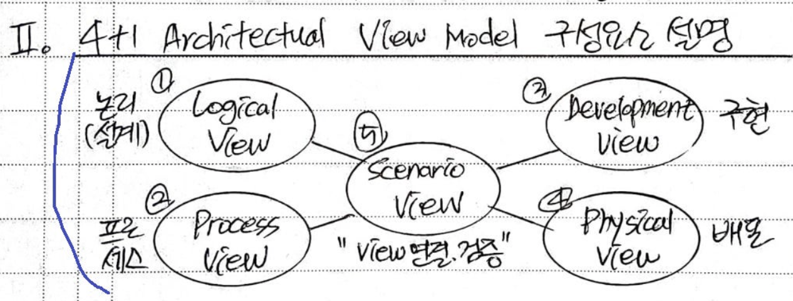
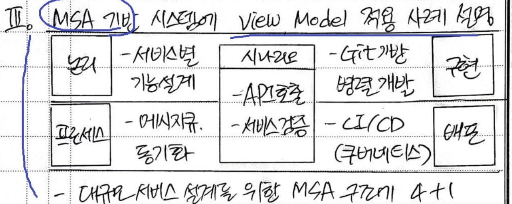

# 소프트웨어 아키텍처 및 설계 산출물 상세 가이드

## 🎯 시험 출제 포인트

### 아키텍처 산출물
- **C4 모델의 4단계별 목적과 내용**
- **ADR의 구성요소와 작성법**
- **품질 속성 시나리오 작성법**
- **4+1 뷰 모델의 각 뷰별 관점**

### 설계 산출물
- **UML 다이어그램 해석 및 작성**
- **시퀀스 다이어그램의 메시지 흐름**
- **ERD의 관계 표현과 정규화**
- **API 명세서의 필수 구성요소**

### 연관 관계
- 아키텍처 산출물 → 설계 산출물로의 **추적성(Traceability)**
- 각 산출물이 해결하는 **품질 속성과의 연관성**
- 이해관계자별 **산출물 활용 목적**

---
## 아키텍처 산출물

### 1. C4 모델 (Context, Container, Component, Code)

- 사이먼 브라운(Simon Brown)이 제안한 소프트웨어 아키텍처 시각화 기법
- 4단계의 추상화 레벨을 통해 시스템을 체계적으로 표현

💡 C4 모델의 핵심 원칙
- 계층적 접근: 큰 그림에서 세부사항으로 점진적 상세화
- 추상화 관리: 각 레벨별 적절한 추상화 수준 유지
- 의사소통 도구: 다양한 이해관계자와의 효과적 소통
- 일관성: 표준화된 표기법과 색상 체계

#### 📍 Level 1: System Context Diagram
- **목적**:
  전체 시스템의 경계와 외부 환경과의 관계를 한눈에 파악 -> **시스템 경계 정의**
- **내용**:
    - 시스템 : 개발 대상 시스템(중앙 위치)
    - 사용자 : 시스템을 사용하는 사람
    - 외부 시스템 : 연동하는 다른 시스템
    - 관계 : 데이터 흐름과 상호작용
- **예시**: "온라인 뱅킹 시스템 ↔ 고객, 은행 직원, 외부 결제 시스템"  
- 🎨 System Context Diagram 표기법


- 📝 예시: 온라인 쇼핑몰 System Context
```
제목: 온라인 쇼핑몰 시스템 컨텍스트

외부 사용자:
- 고객: 상품 검색, 주문, 결제
- 관리자: 상품 관리, 주문 처리, 통계 조회
- 배송업체: 배송 정보 조회

외부 시스템:
- 결제 게이트웨이: 카드 결제 처리
- 재고 관리 시스템: 실시간 재고 확인
- 이메일 서비스: 주문 확인 메일 발송
- SMS 서비스: 배송 알림 문자 발송

주요 데이터 흐름:
- 고객 → 쇼핑몰: 주문 정보
- 쇼핑몰 → 결제게이트웨이: 결제 요청
- 쇼핑몰 → 재고시스템: 재고 조회
- 쇼핑몰 → 고객: 주문 상태 알림
```

#### 📍 Level 2: Container Diagram
- **목적**: 시스템 내부의 고수준 기술 구성요소와 이들 간 통신 방식 표현 -> **배포 단위별 분리**
- **내용**:
    - 웹 애플리케이션 : 사용자 인터페이스
    - API : 비즈니스 로직과 데이터 처리
    - 데이터베이스 : 데이터 저장소
    - 메시징/컨테이너 간 통신 방식 : HTTP, gRPC, 비동기 메시징
- **예시**: "React SPA ↔ Spring Boot API ↔ PostgreSQL DB"
- 🎨 Container Diagram 표기법

- 📝 예시: Container 상세 명세
```yaml
## 프론트 엔드 컨테이너
Web Frontend:
  기술: React.js 18, TypeScript
  책임: 
    - 사용자 인터페이스 제공
    - 클라이언트 사이드 라우팅
    - 상태 관리 (Redux)
  통신:
    - API Gateway와 HTTPS 통신
    - JWT 토큰 기반 인증
  배포: Nginx 웹서버, Docker 컨테이너

Admin Portal:
  기술: Vue.js 3, TypeScript  
  책임:
    - 관리자 전용 기능
    - 대시보드 및 통계
    - 상품/주문 관리
  통신: API Gateway와 HTTPS 통신
  배포: Nginx 웹서버, Docker 컨테이너

## 백엔트 컨테이너
API Gateway:
  기술: Spring Cloud Gateway
  책임:
    - 라우팅 및 로드밸런싱
    - 인증/인가 (JWT 검증)
    - 요청/응답 로깅
    - Rate Limiting
  통신:
    - 프론트엔드와 HTTPS
    - 마이크로서비스와 HTTP

User Service:
  기술: Spring Boot 3, Java 17
  책임:
    - 사용자 등록/로그인
    - 프로필 관리
    - JWT 토큰 발급
  데이터: PostgreSQL (사용자 정보)
  통신: RESTful API

Product Service:
  기술: Spring Boot 3, Java 17
  책임:
    - 상품 CRUD 관리
    - 카테고리 관리
    - 검색 기능
  데이터: MongoDB (상품 정보, 이미지)
  통신: RESTful API

Order Service:
  기술: Spring Boot 3, Java 17
  책임:
    - 주문 처리 로직
    - 결제 연동
    - 재고 차감
  데이터: PostgreSQL (주문 정보)
  통신:
    - RESTful API
    - Kafka 이벤트 발행
```

#### 📍 Level 3: Component Diagram
- **목적**: 각 컨테이너 내부의 주요 구성요소와 책임 분리 표현 -> **컴포넌트 간 의존성**
- **내용**:
    - 컨트롤러: HTTP 요청 처리
    - 서비스: 비즈니스 로직
    - 리포지토리: 데이터 접근
    - 컴포넌트 간 의존성: 호출 관계
- **예시**: "UserController → UserService → UserRepository"
- 🎨 Component Diagram 표기법
  
- 📝 예시: Component 상세 명세
```java
// UserController 예시
@RestController
@RequestMapping("/api/users")
public class UserController {
    
    @Autowired
    private UserService userService;
    
    @PostMapping("/register")
    public ResponseEntity<UserDto> registerUser(@RequestBody @Valid UserRegistrationDto dto) {
        // 사용자 등록 처리
    }
    
    @GetMapping("/{id}")
    public ResponseEntity<UserDto> getUser(@PathVariable Long id) {
        // 사용자 조회 처리
    }
}

// UserService 예시  
@Service
@Transactional
public class UserService {
    
    @Autowired
    private UserRepository userRepository;
    
    @Autowired
    private ValidationService validationService;
    
    public User registerUser(UserRegistrationDto dto) {
        // 1. 입력 검증
        ValidationResult result = validationService.validateUser(dto);
        
        // 2. 중복 확인
        if (userRepository.existsByEmail(dto.getEmail())) {
            throw new DuplicateEmailException();
        }
        
        // 3. 사용자 생성 및 저장
        User user = new User(dto.getEmail(), dto.getName(), hashPassword(dto.getPassword()));
        return userRepository.save(user);
    }
}
```

#### 📍 Level 4: Code Diagram
- **목적**: 실제 클래스 수준의 상세 구현 표현 (선택적)
- **내용**: UML 클래스 다이어그램과 유사
- **활용**: IDE에서 자동 생성 가능
- 🎨 Code Diagram 표기법



### 2. ADR (Architecture Decision Records)

- **목적**: 중요한 아키텍처 결정의 배경과 근거를 문서화

#### 📋 ADR 구성요소
```
제목: ADR-001: 마이크로서비스 아키텍처 선택
상태: 승인됨 / 제안됨 / 폐기됨
컨텍스트: 
- 사용자 증가로 인한 확장성 필요
- 팀 규모 확대 (50명 이상)
- 다양한 기술 스택 필요

결정: 
- 모놀리식에서 마이크로서비스로 전환
- 도메인별 서비스 분리
- API Gateway 도입

근거:
- 독립적 배포 가능
- 기술 스택 다양성 확보
- 팀 자율성 향상

결과:
- 배포 복잡성 증가
- 서비스 간 통신 오버헤드
- 분산 트랜잭션 문제 발생 가능
```

### 3. 아키텍처 뷰 모델 (4+1 View)
- 필립 크뤼슈텐(Philippe Kruchten)이 제안한 소프트웨어 아키텍처 설계 기법
- 복잡한 시스템을 다양한 관점(이해관계자 관심사)으로 이해, 표현하는 SW 아키텍처 설계 방법론  


💡 핵심 철학
- 관심사 분리: 각 이해관계자별 맞춤형 뷰 제공 -> 복잡성 관리
- 다중 관점: 하나의 시스템을 다각도로 바라봄
- 요구사항 검증: 시나리오를 통해 뷰 간 일관성 확인 
- 의사소통 도구: 효과적인 아키텍처 커뮤니케이션

#### 📍4+1 View별 정리
| 관점                                           | 설명                                                 | 표현                                                    |
|----------------------------------------------|----------------------------------------------------|-------------------------------------------------------|
| ① Logical View<br> -> 설계자 관점                 | • 시스템 기능적 요구사항<br>• 구조적 요소, 특성 관계                  | • 클래스/패키지/시퀀스 Diagram<br>• UML다이어그램<br>• ERD |
| ② Process View<br> -> 시스템 통합자 관점             | • 시스템 비기능적 요구사항<br>• 성능, 확장/병렬/동시성<br>• 프로세스간 상호작용 | • 시퀀스/협력 Diagram<br>• 런타임 프로세스<br>• 메시지 통신(비동기,이벤트)   |
| ③ Development View<br> -> 개발자 관점             | • 정적 SW 모듈구조<br>• 컴포넌트 의존성 재사용성                    | • 컴포넌트 Diagram<br>• 모듈, 라이브러리<br>• 컴포넌트               |
| ④ Physical(Deployment) View                  | • 물리적 HW에 SW 배치<br>• 비기능적 요구사항                     | • Deployment Diagram<br>• 가용성(노드,네트워크)<br>• 신뢰성 성능    |
| ⑤ Scenario View<br> -> 사용자, 설계자, 개발자, 테스트 관점 | • 주요 요구사항, 시나리오<br>• UseCase로 4개 View 통합(연결) 검증    | • UseCase Diagram<br>• 요구사항<br>• 시나리오 검증              |

💡 MSA 적용



### 4. 품질 속성 시나리오

**목적**: 비기능적 요구사항(품질 속성)을 구체적으로 정의  
- 측정 가능하고 아키텍처 의사결정을 검증할 수 있도록 구조화된 형태로 표현

💡 품질 속성 시나리오 6가지 요소  

| 요소                           | 설명                              | 예시               |
| ---------------------------- | ------------------------------- | ---------------- |
| **자극원 (Source of Stimulus)** | 품질 속성을 유발하는 주체                  | 1000명 동시 사용자     |
| **자극 (Stimulus)**            | 시스템에 가해지는 이벤트나 입력               | 로그인 요청           |
| **환경 (Environment)**         | 자극이 발생하는 상황, 조건                 | 정상 운영 상태         |
| **아티팩트 (Artifact)**          | 자극이 영향을 미치는 시스템의 부분(컴포넌트, 모듈 등) | 인증 서비스           |
| **응답 (Response)**            | 자극에 대해 시스템이 수행하는 동작             | 로그인 처리           |
| **응답 측정 (Response Measure)** | 품질 속성 충족 여부를 판별할 수 있는 정량적 기준    | 95% 요청이 2초 이내 응답 |

#### 📊 시나리오 구조
```
품질속성: 성능
시나리오: "평균 사용자 1000명이 동시에 로그인할 때, 
          95%의 요청이 2초 이내에 응답되어야 한다"

구성요소:
- 자극원: 1000명 동시 사용자
- 자극: 로그인 요청
- 환경: 정상 운영 상태
- 아티팩트: 인증 서비스
- 응답: 로그인 처리
- 응답 측정: 95% 요청이 2초 이내
```
💡 품질 속성별 예제:

| 품질 속성                      | 자극원 (Source)    | 자극 (Stimulus)          | 환경 (Environment) | 아티팩트 (Artifact) | 응답 (Response)          | 응답 측정 (Response Measure)       |
| -------------------------- | --------------- | ---------------------- | ---------------- | --------------- | ---------------------- | ------------------------------ |
| **성능 (Performance)**       | N명의 동시 사용자      | 특정 서비스 요청              | 정상 운영 상태         | 서비스 컴포넌트        | 요청 처리                  | 95% 요청이 X초 이내 응답               |
| **가용성 (Availability)**     | 사용자/운영자         | 장애 발생 (서버 다운, 네트워크 단절) | 운영 중             | 서비스 전체 또는 특정 서버 | 시스템 자동 복구 / 장애 감지 후 전환 | MTTR ≤ X분, 가용성 99.9% 이상        |
| **보안 (Security)**          | 외부 공격자 / 내부 사용자 | 불법 접근, 권한 없는 요청        | 네트워크 연결 상태       | 인증/인가 모듈        | 접근 거부 및 로그 기록          | 탐지율 ≥ X%, 침투 차단 성공률 ≥ Y%       |
| **변경 용이성 (Modifiability)** | 개발자             | 신규 기능 추가 / 코드 변경 요청    | 유지보수 단계          | 특정 모듈/컴포넌트      | 변경 후 정상 반영             | 수정 완료 ≤ X일, 영향받는 모듈 ≤ Y개       |
| **시험 용이성 (Testability)**   | 테스터             | 기능 검증 요청               | 테스트 환경           | 테스트 대상 모듈       | 테스트 실행 및 결과 확인         | 테스트 스크립트 실행 시간 ≤ X분, 커버리지 ≥ Y% |
| **사용성 (Usability)**        | 최종 사용자          | 기능 수행 요청               | 정상 사용 환경         | UI/UX 컴포넌트      | 작업 처리                  | 평균 학습 시간 ≤ X분, 오류율 ≤ Y%        |


### 5. 배포 다이어그램

**목적**: 시스템의 물리적 배치와 하드웨어 구성

#### 🖥️ 포함 내용
- 서버 노드와 사양
- 네트워크 연결과 프로토콜
- 로드밸런서, 방화벽 등 인프라
- 컨테이너/가상머신 배치
- 데이터 센터/클라우드 영역

---

##  설계 산출물

### 1. UML 다이어그램

#### 📐 클래스 다이어그램
**목적**: 정적 구조와 관계 표현

**구성요소**:
- **클래스**: 속성, 메서드, 가시성
- **관계**: 연관, 집약, 컴포지션, 일반화
- **인터페이스**: 계약 정의
- **패키지**: 논리적 그룹핑

**예시**:
```
┌─────────────────┐    ┌───────────────────┐
│     Order       │◆──▷│   OrderItem       │
├─────────────────┤    ├───────────────────┤
│- orderId: Long  │    │- quantity: int    │
│- date: Date     │    │- price: BigDecimal│
├─────────────────┤    ├───────────────────┤
│+ addItem()      │    │+ getTotal()       │
│+ getTotal()     │    └───────────────────┘
└─────────────────┘
```

#### 🔄 시퀀스 다이어그램
**목적**: 시간 순서에 따른 객체 간 상호작용

**구성요소**:
- **액터**: 외부 엔티티
- **객체**: 생명선(lifeline)
- **메시지**: 동기/비동기 호출
- **활성화**: 실행 시간

**예시**:
```
고객    →  주문서비스  →  결제서비스  →  재고서비스
 │         │           │           │
 │ 주문요청  │           │           │
 │────────▶│           │           │
 │         │ 결제처리    │           │
 │         │──────────▶│           │
 │         │           │ 재고확인   │
 │         │           │──────────▶│
 │         │           │ 재고응답   │
 │         │           │◀──────────│
 │         │ 결제완료    │           │
 │         │◀──────────│           │
 │ 주문완료  │           │           │
 │◀────────│           │           │
```

#### 📊 상태 다이어그램
**목적**: 객체의 상태 변화와 전이 조건

**구성요소**:
- **상태**: 객체가 가질 수 있는 조건
- **전이**: 상태 변화
- **트리거**: 전이를 발생시키는 이벤트
- **가드**: 전이 조건

### 2. API 명세서

**목적**: 서비스 간 인터페이스 계약 정의

#### 📝 OpenAPI/Swagger 명세
```yaml
paths:
  /api/users/{id}:
    get:
      summary: 사용자 정보 조회
      parameters:
        - name: id
          in: path
          required: true
          schema:
            type: integer
      responses:
        '200':
          description: 성공
          content:
            application/json:
              schema:
                $ref: '#/components/schemas/User'
        '404':
          description: 사용자 없음
```

### 3. 데이터베이스 설계

#### 🗄️ ERD (Entity Relationship Diagram)
**목적**: 데이터 모델과 관계 정의

**구성요소**:
- **엔티티**: 실세계 객체
- **속성**: 엔티티의 특성
- **관계**: 엔티티 간 연관성
- **카디널리티**: 관계의 수량 제약

**예시**:
```
┌─────────────┐     ┌─────────────┐     ┌─────────────┐
│    고객      │     │    주문      │     │   상품       │
├─────────────┤     ├─────────────┤     ├─────────────┤
│ 고객ID (PK ) │────▷│ 주문ID (PK) │◁────│ 상품ID (PK)   │
│ 고객명       │ 1:N │ 고객ID (FK)  │ M:N │ 상품명        │
│ 이메일       │     │ 주문일자      │     │ 가격         │
│ 전화번호      │     │ 총금액       │     │ 재고수량      │
└─────────────┘     └────────────┘     └─────────────┘
```

### 4. 상세 설계 문서

#### 🔍 컴포넌트 상세 명세
```
컴포넌트명: UserService
책임: 사용자 관리 비즈니스 로직
인터페이스:
- createUser(UserDto): User
- updateUser(Long, UserDto): User
- deleteUser(Long): void
- findUser(Long): Optional<User>

의존성:
- UserRepository: 데이터 접근
- EmailService: 이메일 발송
- ValidationService: 데이터 검증

제약사항:
- 이메일 중복 불가
- 비밀번호 8자 이상
- 삭제 시 연관 데이터 확인
```
